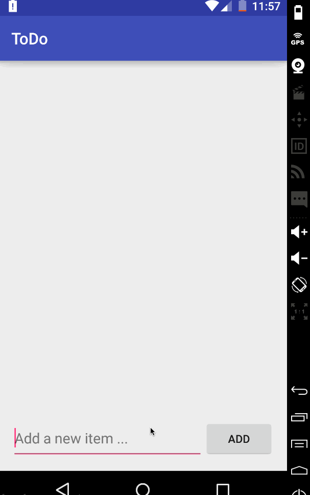

#Codepath Android 2016 Pre Work

This is the pre work for the Codepath Android course

Time spent: 2 hours spent in total

Submission Check List

* :white_check_mark: Required: Can you successfully add and remove items from the todo list within your app?
* :white_check_mark: Required: Did you include support for editing todo items as described above?
* :white_check_mark: Required: Does your app persist todo items and retrieve them properly on app restart?
* :white_check_mark: Required: Did you successfully push your code to github? Can you see the code on github?
* :white_check_mark: Required: Did you add a README which includes a GIF walkthrough of the app's functionality?
* :white_check_mark: Required: Did you create an issue on the repo and include /cc @codepathreview @codepath in the issue body?
* :white_check_mark: Suggested: Persist the todo items into SQLite instead of a text file USED ACTIVE ANDROID
* :white_check_mark: Suggested: Improve style of the todo items in the list using a custom adapter
* :white_check_mark: Suggested: Add support for completion due dates for todo items (and display within listview item)
* :white_large_square: Suggested: Use a DialogFragment instead of new Activity for editing items
* :white_check_mark: Suggested: Add support for selecting the priority of each todo item (and display in listview item)
* :white_large_square: Suggested: Tweak the style improving the UI / UX, play with colors, images or backgrounds

Walkthrough of all user stories:

GIF created with [LiceCap](http://www.cockos.com/licecap/).
